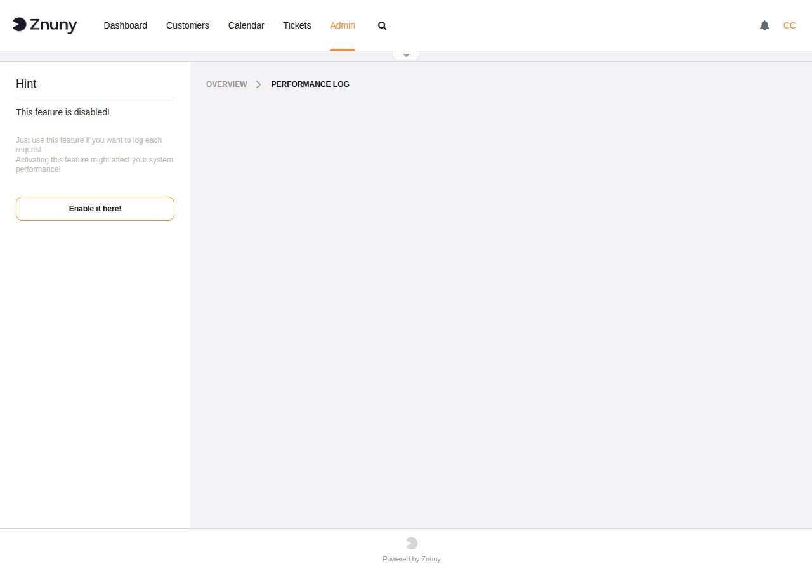
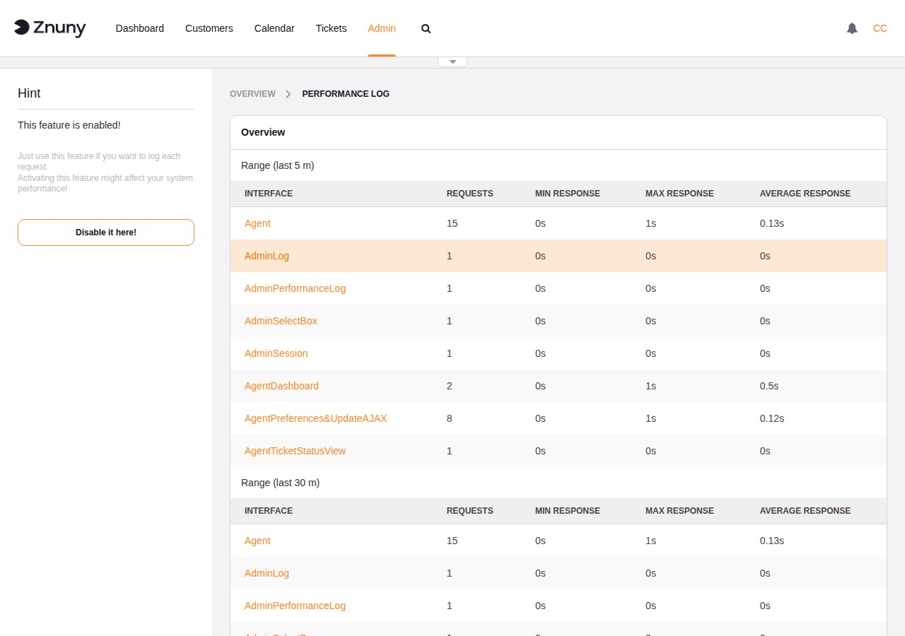
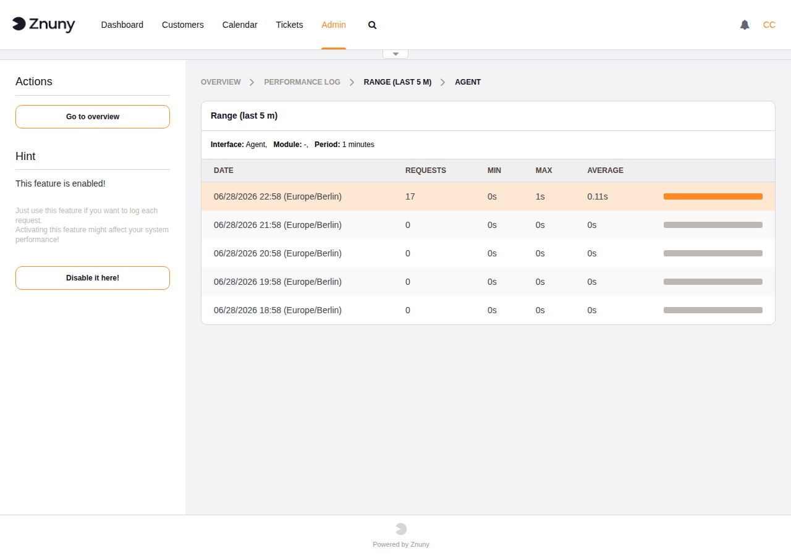

.. meta::
   :description: Use the Znuny Performance Log to measure HTTP request response times per interface and module — enable, read the overview table, drill into time-range detail views, and manage log file size.
   :keywords: znuny performance log, request timing, response time, performance monitoring, AdminPerformanceLog, PerformanceLog SysConfig

.. _PageNavigation standardoperations_performancelog_index:

Performance Log
###############

The Performance Log records the response time of every HTTP request handled by Znuny, broken down by interface (Agent, Customer, Public) and by module. It is an opt-in diagnostic tool — disabled by default because recording timing data for every request adds a small overhead to each page load.

Use it when you need to identify which parts of the application are slow, or to establish a response-time baseline before and after a configuration change.

Enabling and Disabling
**********************

Navigate to **Admin → Performance Log**. When the feature is off, the sidebar shows a **Enable it here!** button.

Clicking the button navigates to the ``PerformanceLog`` setting in System Configuration. Set it to **Enabled** and deploy. You can also search for ``PerformanceLog`` in System Configuration directly.

Once active, the sidebar shows a **Disable it here!** button. Click it to turn the feature off and stop recording new data.

.. note::

   Enabling this feature on a busy system will increase disk I/O slightly. Disable it once you have gathered the data you need.

Overview
********

When enabled, the overview page shows one table for each time window: last 5 minutes, 30 minutes, 1 hour, 2 hours, 24 hours, and 48 hours. Within each table, rows are grouped by interface and then by module.

The columns in each table are:

Interface
   The interface that served the request: ``Agent``, ``Customer``, or ``Public``.

Requests
   Number of requests recorded in the time window.

Min Response
   Fastest recorded response time.

Max Response
   Slowest recorded response time.

Average Response
   Mean response time across all requests in the window.

Each module name in the table is a link that opens the detail view for that specific module and time range.

Detail View
***********

The detail view shows request volume and timing for the selected module over the chosen time window, sliced into smaller periods. The breadcrumb shows the time range and interface being viewed.

The columns are:

Date
   Start of the period (time zone shown in brackets).

Requests
   Number of requests in that period.

Min / Max / Average
   Response time statistics for the period.

The orange bar at the right of each row is proportional to the number of requests in that period — the busiest period gets a full-width bar.

Log File and Size Limit
***********************

Performance data is written to a flat file configured by the ``PerformanceLog::File`` SysConfig setting. The default path is ``<home>/var/log/PerformanceLog``.

The ``PerformanceLog::FileMax`` setting controls the maximum file size in megabytes (default: 25 MB). When the file exceeds this limit the overview page shows a **Reset** button instead of the statistics table. Clicking Reset deletes the log file and starts fresh — there is no way to download the data before resetting, so act before hitting the limit if the data matters.
