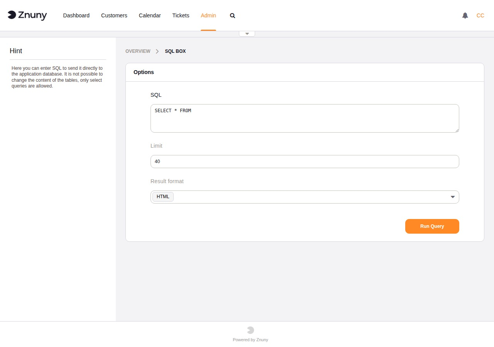
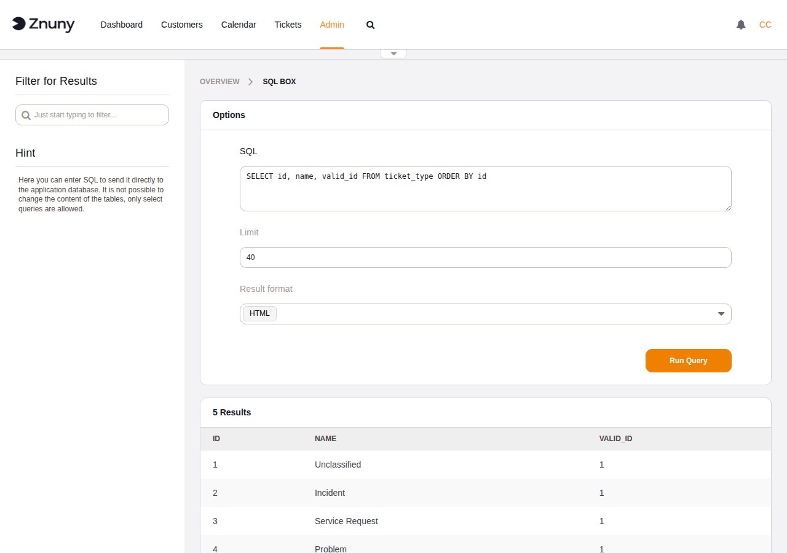

.. meta::
   :description: Use the Znuny SQL Box to run SELECT queries against the application database directly from the browser — read data, export to CSV or Excel, and understand the write-access setting.
   :keywords: znuny sql box, AdminSelectBox, database query, select query, znuny database, csv export, sql tool

.. _PageNavigation standardoperations_selectbox_index:

SQL Box
#######

The SQL Box lets you run SQL queries against the Znuny application database directly from the administration interface, without needing a separate database client. It is intended for read-only investigation — looking up data, verifying configuration, or checking record counts.

.. important::

   The SQL Box is only accessible when **Secure Mode** is enabled in System Configuration (``SecureMode = 1``). If you see an access-denied message, enable Secure Mode first.

Navigate to **Admin → SQL Box** to open the module.

Running a Query
***************

The form has three fields:

SQL
   The query to execute. Pre-filled with ``SELECT * FROM `` as a starting point. By default, only ``SELECT``, ``SHOW``, and ``DESC`` statements are accepted — attempting anything else returns a validation error.

Limit
   Maximum number of rows to return. Default is ``40``. Raise this when you need to see more rows, but be aware that very large result sets slow the browser down.

Result Format
   How to present the output:

   HTML
      Results are rendered as a table in the browser with a **Filter for Results** search box in the sidebar. Useful for quick inspection.

   CSV
      Results are downloaded immediately as a ``.csv`` file. The separator follows the agent's personal CSV separator preference.

   Excel
      Results are downloaded as a ``.xlsx`` file.

Click **Run Query** to execute.

Reading Results
***************

HTML results appear below the form in a table with column headers taken from the query. The row count is shown above the table. Use the **Filter for Results** box in the sidebar to narrow down rows client-side without re-running the query.

Database Compatibility
**********************

The SQL Box works on all databases Znuny supports, but with differences in
what statements are useful depending on the backend.

Statement support varies by database. The validator accepts ``SELECT``,
``SHOW``, and ``DESC`` on all backends, but ``SHOW`` and ``DESC`` are only
valid SQL on MySQL/MariaDB.

.. list-table::
   :header-rows: 1
   :widths: 20 20 20 40

   * - Statement
     - MySQL/MariaDB
     - PostgreSQL
     - Oracle
   * - ``SELECT``
     - Yes
     - Yes
     - Yes — Oracle-specific syntax (``ROWNUM``, ``DUAL``, etc.) is supported.
   * - ``SHOW TABLES``
     - Yes
     - No — use ``SELECT table_name FROM information_schema.tables WHERE table_schema = 'public' ORDER BY table_name``
     - No — use ``SELECT table_name FROM user_tables ORDER BY table_name``
   * - ``DESC tablename``
     - Yes
     - No — use ``SELECT column_name, data_type FROM information_schema.columns WHERE table_name = 'tablename' ORDER BY ordinal_position``
     - No — use ``SELECT column_name, data_type FROM all_tab_columns WHERE table_name = 'TABLENAME' ORDER BY column_id``
   * - ``SHOW STATUS``
     - Yes
     - No
     - No
   * - Row limit field
     - Appends ``LIMIT n`` to the SQL.
     - Appends ``LIMIT n`` to the SQL. Do not add your own ``LIMIT`` clause when the field is set.
     - Applied at fetch time — no ``LIMIT`` clause is added. Fully transparent.

Allowing Write Operations
*************************

By default the module enforces read-only access. To allow ``INSERT``, ``UPDATE``, ``DELETE``, and other write statements, enable the SysConfig setting ``AdminSelectBox::AllowDatabaseModification``.

.. warning::

   Enabling write access allows direct modification of application data without any of the validation or event handling that normally runs when data is changed through the interface. Changes made this way can leave data in an inconsistent state. Only enable this setting when you have a specific, well-understood need, and disable it again immediately afterwards.
