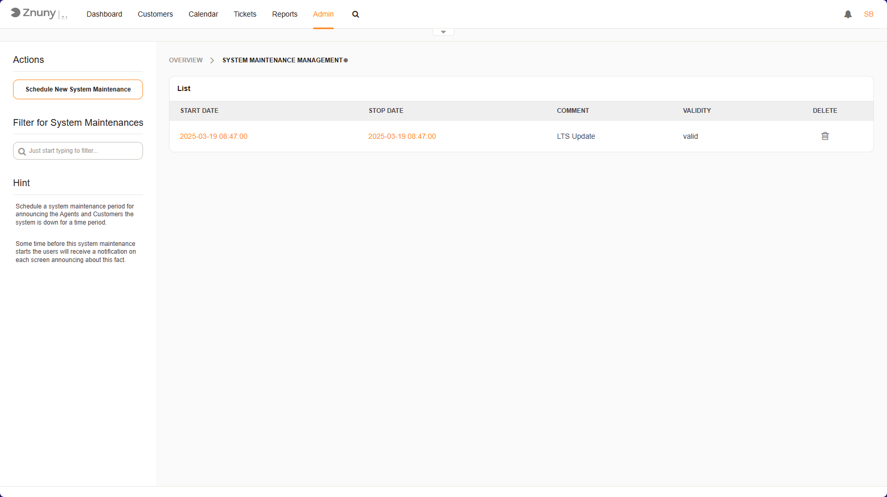
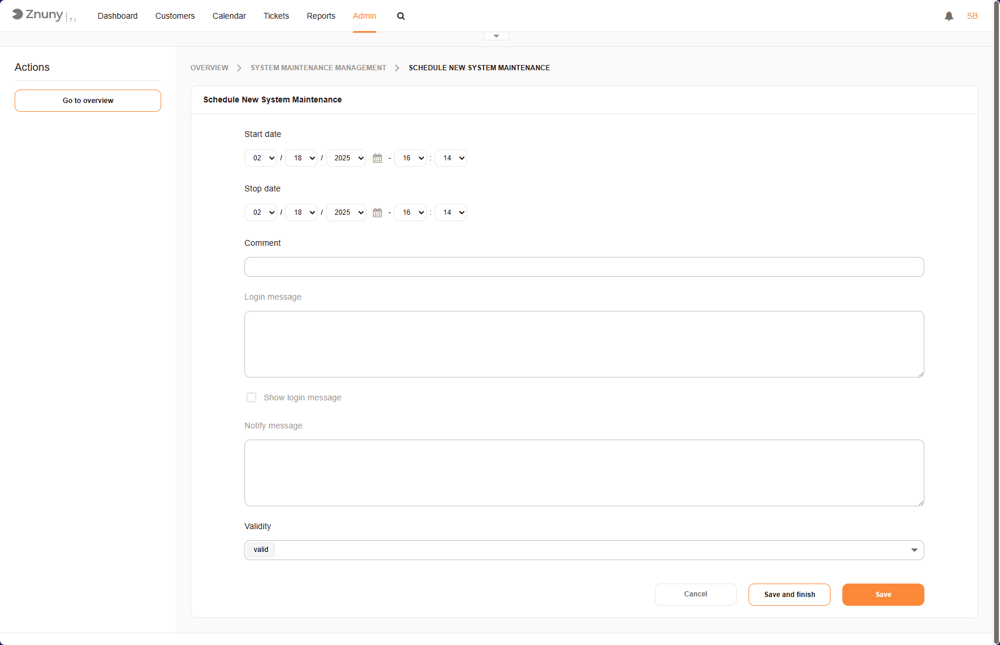
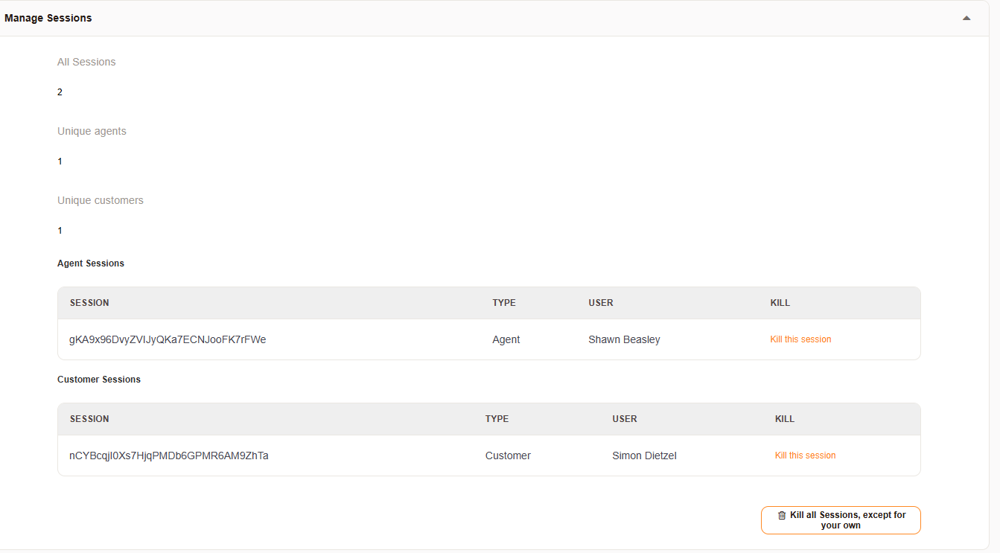
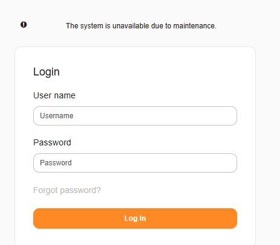

.. _PageNavigation standardoperations_system_maintenance:

Planned Maintenance
###################

Maintenance Overview
********************

    System Maintenance Overview

This screen allows **administrators** to **schedule and manage system maintenance** in Znuny. Here’s what you can do:  

- **Schedule a Maintenance Window** - Define the timeframe for planned maintenance.  
- **Update a Scheduled Maintenance Window** - Modify existing maintenance schedules.  
- **Manage Sessions** - Delete unwanted sessions before starting maintenance.  
- **Delete or Invalidate a Scheduled Maintenance Window** - Remove or mark maintenance as inactive.  

Maintenance Window Settings
***************************

    System Maintenance Item

Navigate to **Admin > System Maintenance**.

1. **Set a start and stop date/time**  

   Use the dropdown selectors to specify the maintenance period.  

2. **Add Informational Messages for Users**  

   - **Comment Field** - Add internal notes regarding the maintenance.  
   - **Login Message** - Display a message for non-admin users attempting to log in during maintenance.  
   - **Show login message** - Check this box to enable the login message.  
   - **Notify Message** - Provide additional information for users in the notification area.  

.. note:: 

    The message will be displayed before and during the maintenance window. This behavior can be configured 
    using the setting ``SystemMaintenance::TimeNotifyUpcomingMaintenance``.

3. **Set Validity**  

   - Choose whether the maintenance schedule is **valid** or requires adjustments.  

4. **Save or Cancel the Maintenance Plan**  

   - **Save and Finish** - Save changes and close the form.  
   - **Save** - Save changes but keep the form open for further modifications.  
   - **Cancel** - Discard changes and return to the previous page.

.. important:: 

   Only users with rw permissions in the admin group can login to system during maintenance.

Manage Sessions
***************

Before starting an maintenance, all sessions should be ended. You may open the maintenance window 
for editing and scroll to the bottom section. Here you can choose to end all active sessions except 
for your own.

    Session Management

User Notifications
******************

Customer users and agents received notifications in the notification area about upcoming maintenance periods.

   User Notification

When maintenance begins, the agents and users will also see a login message, if configured.

   Login Message
