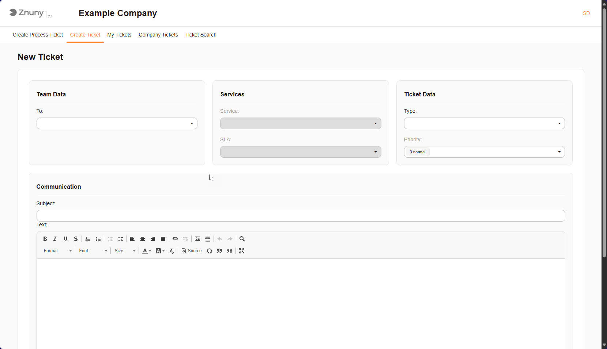
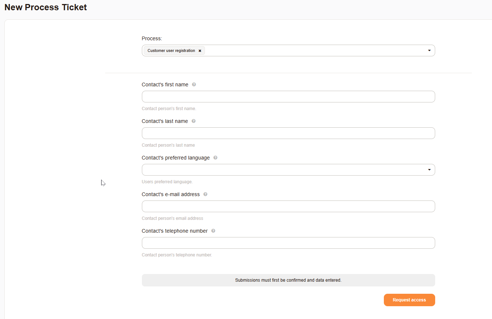

Register a Request
##################

Tickets can be created via email, web interfaces, or API. This document provides an overview of the ticket creation process via the web interface and the information typically required when creating a ticket.

As shown below, this page allows you to register a new request. Please fill in the required fields and provide as much detail as possible to help us assist you effectively.

   New Ticket Mask

The following information is typically required when creating a ticket:

Team Data
*********

- **To**: Teams of users who manage and resolve tickets. 
  
Services
********

-  **Service**: A service is a specific offering or functionality provided by the organization to its users or customers. It can include IT services, customer support, or any other type of service that requires ticketing.
-  **SLA**: Service Level Agreement (SLA) is a formal agreement that defines the expected level of service between the service provider and the customer. It outlines the response and resolution times for different types of tickets, ensuring that users receive timely support.

Ticket Data
***********

- **Type**: A classification of the ticket, such as incident, problem, or change request. This helps in categorizing and managing tickets effectively.
- **Priority**: A ranking of the ticket's urgency or importance, often determined by factors like impact and urgency. This helps prioritize tickets for resolution.
  
Communications
**************
- **Subject**: A brief summary or title of the ticket, providing a quick overview of the issue or request.
- **Text**: The detailed description of the ticket, including all relevant information about the issue or request. This is where users provide context and specifics to help the support team understand the problem.

Other Fields
************

The list of other fields may vary depending on the specific configuration and modules.

Process Tickets
***************

Process tickets are an additional type of request, not configured by default. A process ticket is a ticket that is created to track the progress of a specific process or workflow. It is used to manage and monitor the various stages and tasks involved in completing a particular process. Process tickets are often used in project management, IT service management, and other areas where processes need to be tracked and managed. A process ticket will always have dialogs for registering and responding, which are non-standard. Speak to your administrator for more information on what is required for each process. 

Below you will se an example of a process ticket.

   Example Process Ticket

   