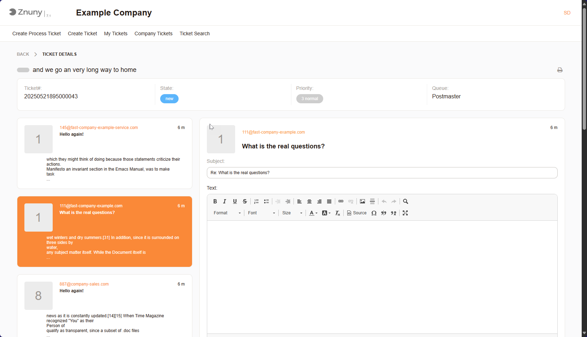
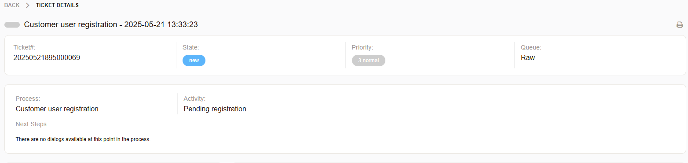

Respond to Requests
###################

If you are a customer user, you can respond to requests by selecting the ticket. You will 
see all other communications. Select the communications to respond to, then add your reply.

   Reply View

The following information is typically required when responding to a ticket:

- **Subject**: A brief summary or title of the response, providing a quick overview of the message.
- **Text**: The detailed description of the response, including all relevant information about the issue or request. This is where users provide context and specifics to help the support team understand the problem.
- **Attachments**: Any files or documents that are relevant to the response. This can include screenshots, logs, or other supporting materials that help clarify the issue or request.
- **State**: The current status of the ticket, which may include options like "open," "in progress," or "resolved." This helps track the progress of the ticket and ensures that it is being addressed appropriately.
- **Priority**: A ranking of the ticket's urgency or importance, often determined by factors like impact and urgency. This helps prioritize tickets for resolution.

.. note:: 
   
   The fields may vary depending on the specific configuration and modules.

   Resolve
   *******

   To resolve a ticket, you can select the ticket and set the state to "closed succcessfully" or "closed unsuccessfully."

.. important:: 
   
   Based on the configuration, you may not be able to change the state of a ticket. In this case, you will need to contact your administrator. 
   Other states may be available, such as "in progress" or "waiting for agent." These states help track the ticket's status and ensure that it is being addressed appropriately.
   
Process Ticket Information
***************************

In the case you have a process ticket, you will see the following additional information:

   Process Ticket Information

You can still create a free-form response, but also may have additional tasks in the *Next Steps* section.