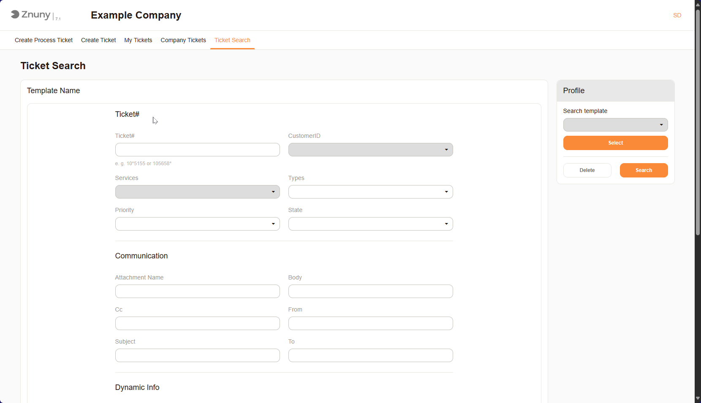
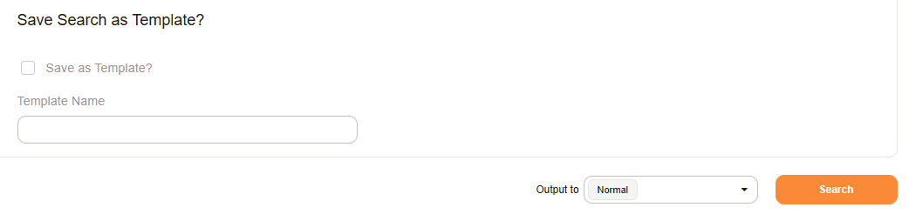
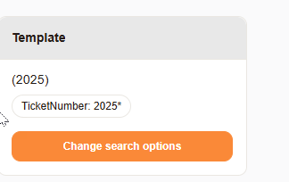

Search for Tickets
##################

You can search for tickets in the system using various criteria. This section provides an overview of how to search for tickets, including filtering by 
status, priority, and other attributes.

   Ticket Search Screen

Save a Search Template
**********************

You can save your search criteria for future use. This allows you to quickly access frequently used searches without having to re-enter the criteria each time.

1. To save a search, select Save as Template and enter a name for the template.
2. Then click Search.

   Save Search Profile

Access Saved Searches
*********************

Access the saved searches by clicking on the Search Profile name. This is displayed in the top right corner of the search screen.

   Access Saved Searches
   

.. important:: 
   
   Due to system configurations, you may not see all tickets in the system which are registered to your user. Speak to your system administrator if you have any questions about this.
