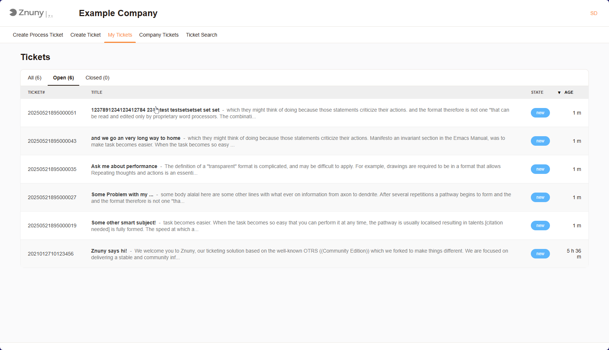

View Open Requests
##################

If you have already opened a request, upon login you will be redirected to the "My Requests" page. This page displays a list of all your open requests, allowing you to view their status and details. You can also search for specific requests using the search bar or filter options.

   My Tickets Overview

.. important:: 
   
   Due to system configurations, you may not see all tickets in the system which are registered to your user. Speak to your system administrator if you have any questions about this.

.. note::

   You may sort the tickets by clicking on the column headers. This allows you to organize the tickets based on different criteria, such as priority or status.

Tickets By State
****************

You can choose from the "All", "Open", and "Closed" Filters. This allows you to filter the tickets based on their current status, making it easier to find the tickets you need.

Company Tickets
***************

If your system is configured to allow it, you can view all tickets registered to your company. This is useful for tracking the status of others requests and ensuring 
that all issues are being addressed. Viewing and responding works identiaclly to the "My Tickets" page.