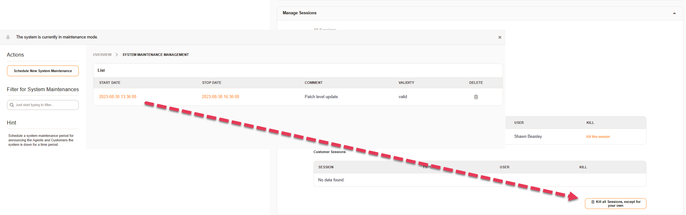

.. meta::
   :description: Upgrade from Znuny 7.2.x to 7.3 — follow the migration steps, test on a staging system first and back up your data before running the upgrade scripts.
   :keywords: znuny update 7.3, znuny 7.2 to 7.3, minor level update, znuny upgrade, znuny migration, znuny 7.3 install

Update to Znuny 7.3
###################

.. important::	We highly recommend to update on a test instance first. Backup your data!

This documentation explains how to update to the Znuny 7.3 release.

Please note that your current system needs to be a

- Znuny 7.2.x for a minor level update or
- Znuny 7.3.x for a patch level update

We do not support direct updates from any version before Znuny 7.2.
	

Preparations
************

.. note::

  Check if every add-on your are using is available for version 7.3 **before** you continue. Add-ons for Znuny 7.2 or older versions are not compatible with Znuny 7.3 and needs to be updated. Ask the **vendor** of the add-on when in doubt.

Before the update can started we need to perform some tasks to prepare the update.

You should or should have entered a scheduled maintenance time period in the admin area. Login as your admin user, select the active maintenance window and kill all sessions but your own. Now only administrators can login.

	Maintenance Session Managment

Create a backup of the database, the application and all data, especially the attachments.

.. tab-set::
  :sync-group: distribution

  .. tab-item:: RHEL based
    :sync: rhel

      .. code-block::
        :caption: Stop all services

          systemctl stop httpd
          # Stop your local MTA, mostly Postfix, sometimes Exim or Sendmail
          systemctl stop postfix 
          # Remove crontab, stop daemon
          su -c 'bin/Cron.sh stop' - znuny
          su -c 'bin/znuny.Daemon.pl stop' - znuny

  .. tab-item:: Debian based
    :sync: debian

      .. code-block::
        :caption: Stop all services
  
          systemctl stop apache2
          # Stop your local MTA, mostly Postfix, sometimes Exim or Sendmail
          systemctl stop postfix 
          # Remove crontab, stop daemon
          su -c 'bin/Cron.sh stop' - znuny
          su -c 'bin/znuny.Daemon.pl stop' - znuny

..

Update via RPM
**************

The update via RPM for RHEL based Linux distributions.

.. important::

  Starting with version 7.3.2 we sign our RPMs. Please import our GPG key with these instructions:

  .. code-block:: bash

    curl -LO https://download.znuny.org/znuny-release-key.asc
    rpm --import znuny-release-key.asc

You can find the correct URL for your RPM at https://www.znuny.org/releases. 

.. code-block:: bash

	# Update to Znuny 7.3
	dnf update -y https://download.znuny.org/releases/RPMS/rhel/7/znuny-7.3.4-01.noarch.rpm

	# Check for missing modules and add required modules and install at least **required** modules.
	/opt/znuny/bin/znuny.CheckModules.pl --all

.. 

Update via source
*****************

The installation from source takes more steps. If there are more file to restore than mentioned in the restore block, add them by yourself.

.. code-block:: bash

  # Download latest Znuny 7.3
  cd /opt
  wget https://download.znuny.org/releases/znuny-latest-7.3.tar.gz

  # Optional: verify the checksum of the downloaded version
  curl -LO https://download.znuny.org/releases/znuny-latest-7.3.tar.gz.sha256
  sha256sum -c znuny-latest-7.3.tar.gz.sha256

  # Optional: verify the GPG signature for the downloaded version,
  # the import is only required once
  curl -LO https://download.znuny.org/znuny-release-key.asc
  gpg --import znuny-release-key.asc
  curl -LO https://download.znuny.org/releases/znuny-latest-7.3.tar.gz.asc
  gpg --verify znuny-latest-7.3.tar.gz.asc znuny-latest-7.3.tar.gz

  # Extract
  tar xfz znuny-latest-7.3.tar.gz

  # Set permissions
  /opt/znuny-7.3.4/bin/znuny.SetPermissions.pl

  # Restore Kernel/Config.pm, articles, etc.
  cp -a /opt/znuny/Kernel/Config.pm /opt/znuny-7.3.4/Kernel/
  mv /opt/znuny/var/article/* /opt/znuny-7.3.4/var/article/

  # Restore dotfiles from the homedir to the new directory
  for f in $(find -L /opt/znuny -maxdepth 1 -type f -name .\* -not -name \*.dist); do cp -av "$f" /opt/znuny-7.3.4/; done

  # Restore modified and custom cron job
  for f in $(find -L /opt/znuny/var/cron -maxdepth 1 -type f -name \* -not -name \*.dist); do cp -av "$f" /opt/znuny-7.3.4/var/cron/; done

  # Create/overwrite a symlink 
  ln -snf /opt/znuny-7.3.4 /opt/znuny

  # Check for missing modules and add **required** modules
  /opt/znuny/bin/znuny.CheckModules.pl --all

..

Execute the migration script
****************************

.. code-block:: shell

    su -c 'scripts/MigrateToZnuny7_3.pl --verbose' - znuny

..

If the migration script fails check the error and try to fix it. Do **not** continue until the migration scripts returns "Migration completed!"

Reinstall or Upgrade Add-ons (Packages)
***************************************
	
.. note:: UpgradeAll can fail, if repositories are not reachable or configured, versions for your framework are not available, or packages have been renamed. In this case, you should upgarde your packages manually via the commandline or by installing/updating them via the package manager.

.. code-block:: shell

    # Make sure all add-ons are correct installed after a patch level update
    su -c 'bin/znuny.Console.pl Admin::Package::ReinstallAll' - znuny
    su -c 'scripts/MigrateToZnuny7_3.pl --verbose' - znuny
    # Upgrade all packages
    su -c 'bin/znuny.Console.pl Admin::Package::UpgradeAll' - znuny
    su -c 'scripts/MigrateToZnuny7_3.pl --verbose' - znuny
    

..

Restart everything
******************

.. important:: Before starting the cron or mail service and daemon, you should ensure the frontend is working properly. Once new mails are received, or articles are created, a roll back is much more difficult, and mails may get lost.

.. tab-set::
  :sync-group: distribution

  .. tab-item:: RHEL based
    :sync: rhel

      .. code-block::
        :caption: Start all services

          systemctl start httpd
          # Start your local MTA, mostly Postfix, sometimes Exim or Sendmail
          systemctl start postfix 
          # Fill the crontab and wait(!) at least 5 minutes that the Daemon is started via cron
          su -c 'bin/Cron.sh start' - znuny

  .. tab-item:: Debian based
    :sync: debian

      .. code-block::
        :caption: Start all services
  
          systemctl start apache2
          # Start your local MTA, mostly Postfix, sometimes Exim or Sendmail
          systemctl start postfix 
          # Fill the crontab and wait(!) at least 5 minutes that the Daemon is started via cron
          su -c 'bin/Cron.sh start' - znuny

Deactivate maintenance 
**********************

Don't forget to deactivate the scheduled maintenance, so that your users and customers can log in again.
